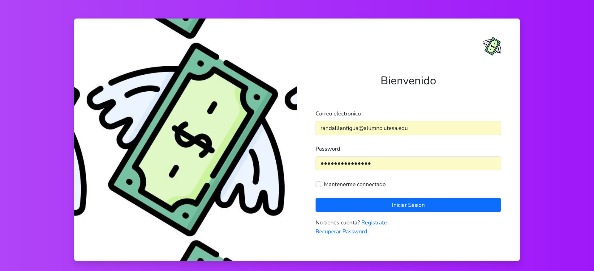
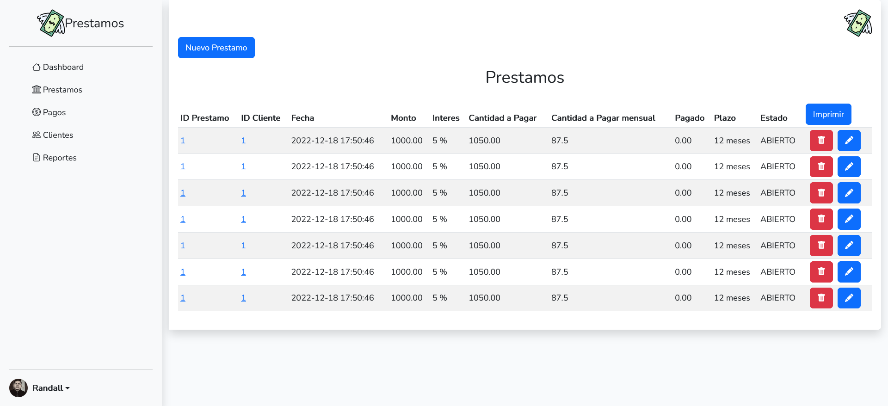
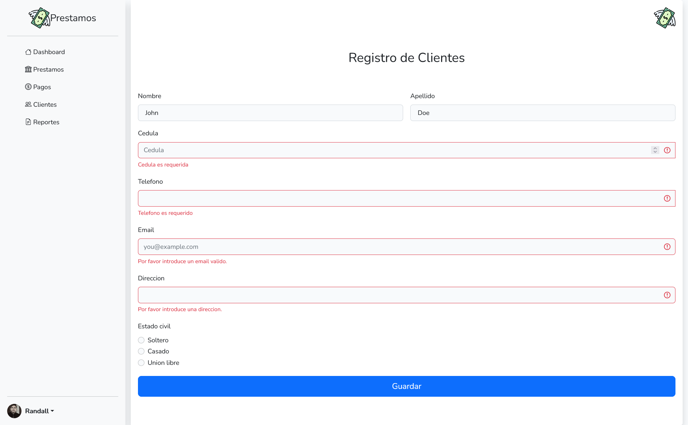

## Prestamos UTESA.
---




### Requerimientos
```
 "php": ">=8.2.0"
 "laravel" >="9.0.0"
 "nodejs" '>=18.0.0'
 "composer" ">=8.0.0"
 "xampp" ">=2.0.0"
```

### Instalación

Ejecutar los siguientes comandos en orden
```cmd
git clone git@github.com:AcidSugar27/prestamos.git
```
```cmd
cd prestamos
```
```cmd
composer install
npm install
```

Seguidamente recuerda que por seguridad el archivo <b>"<em>.env</em>"</b> no se copia, para ello dispones del mismo pero con el nombre <b>"<em>.env.example</em>"</b> el cual deberás renombrar a <b>"<em>.env</em>"</b> solamente.

Recuerda también ingresar en el archivo <b>"<em>.env</b>"</em> los datos de conexión a la base de datos que deberás haber creado previamente.

Procedemos a crear una base de datos nombrada como deseemos para este caso usaremos `laravels`

```
sudo mysql -u root
```
```sql
CREATE DATABASE laravels; 
```

o podemos crearla de forma grafica en nuestro phpmyadmin.
![[Pasted image 20221218185212.png]]

Una vez creado, procedemos a hacer una migración con los siguientes comandos.

```cmd
php artisan migrate
```

__NOTA:__ Recuerda para un optimo funcionamiento en modo PRODUCCION en el archivo `.env` establece los siguientes valores de esta manera se desactiva los logs.
```
APP_ENV=production
APP_DEBUG=false
```

Finalmente para iniciar nuestra aplicación utilizamos
```cmd
npm run dev
php artisan serve
```


